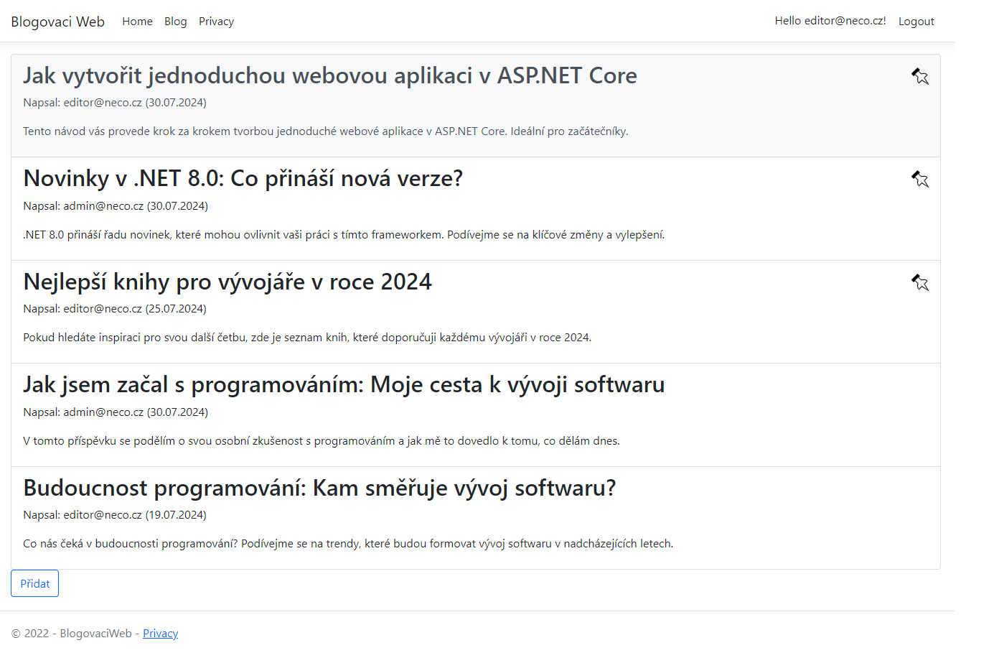
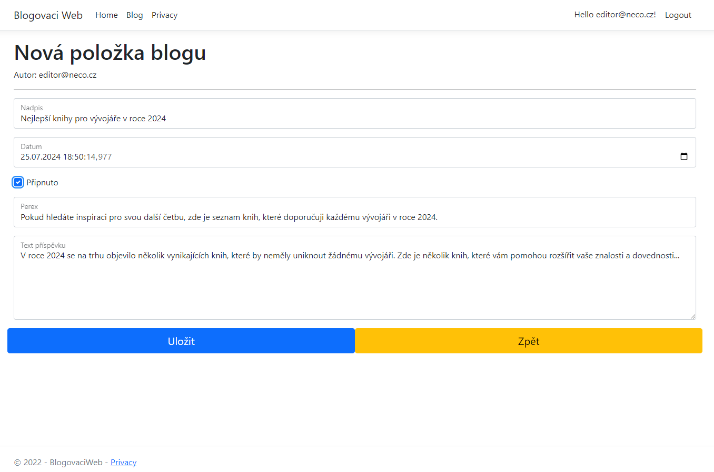
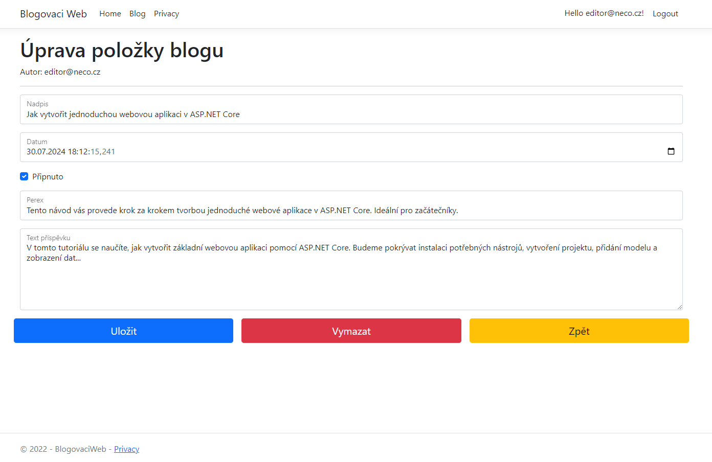

# Blogovací Web

## Popis projektu

Tento projekt je blogovací web vytvořený pomocí C# a .NET 8.0, s využitím databáze Microsoft SQL Server (MSSQL) na místním serveru. Webová aplikace umožňuje uživatelům procházet blogy, vytvářet nové příspěvky, editovat je a mazat.

## Funkcionality

- **Procházení blogů**: Uživatelé mohou prohlížet seznam blogů bez nutnosti přihlášení.
- **Vytváření příspěvků**: Pro vytvoření nového blogového příspěvku je vyžadováno přihlášení.
- **Editace příspěvků**: Přihlášení uživatelé mohou upravovat své vlastní blogové příspěvky.
- **Mazání příspěvků**: Přihlášení uživatelé mohou mazat své blogové příspěvky.
- **Zobrazení detailů příspěvku**: Každý blog obsahuje nadpis, datum publikace, označení zda je příspěvek připnutý, perex a text příspěvku.

## Technologie

- **Backend**: C# a .NET 8.0
- **Frontend**: HTML, CSS, JavaScript
- **Databáze**: Microsoft SQL Server (MSSQL)
- **Autentizace**: Implementováno pomocí ASP.NET Identity pro správu uživatelů a jejich přihlášení

## Ukázky webu:
Blogy:
# 
Vytvoření blogu:
# 
Editace blogu:
# 
